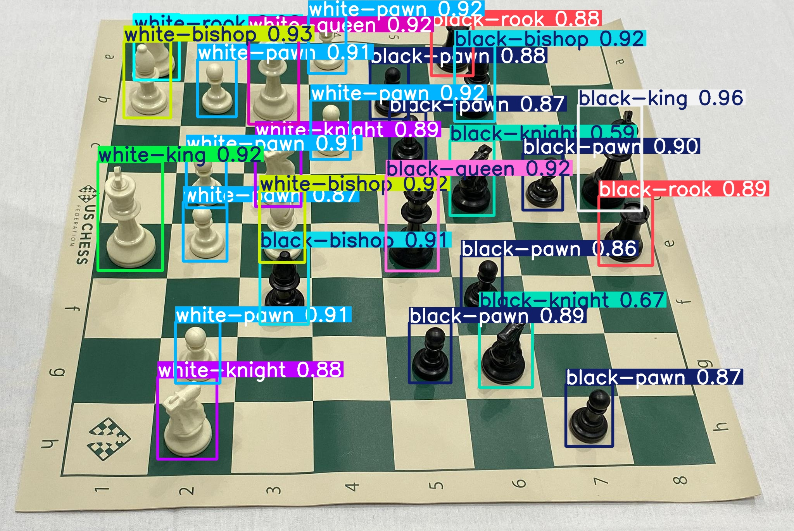

# ChessTracker: Seguimiento y Reconocimiento de Tableros de Ajedrez con Visión Computacional

## 1. Resumen del problema y su impacto social

El ajedrez es reconocido mundialmente como una herramienta educativa que desarrolla habilidades cognitivas, estratégicas y sociales. Sin embargo, la digitalización de partidas físicas sigue siendo un reto, especialmente en contextos educativos, clubes y torneos donde no se dispone de tableros electrónicos.  
**ChessTracker** busca cerrar esta brecha permitiendo la reconstrucción automática de partidas físicas a partir de imágenes, facilitando el análisis, la enseñanza y la inclusión digital.  
El impacto social es significativo:  
- **Inclusión:** Jugadores sin acceso a tecnología avanzada pueden digitalizar y compartir sus partidas.
- **Educación:** Docentes y estudiantes pueden analizar partidas reales, fomentando el aprendizaje activo.
- **Transparencia:** Torneos presenciales pueden documentar partidas de forma precisa y accesible.
- **Accesibilidad:** Personas con discapacidad visual pueden beneficiarse de la digitalización para acceder a herramientas de análisis y lectura automática.

---

## Estructura del repositorio

```
ChessTracker/
│
├── main.py
├── src/
│   ├── board_detection.py
│   ├── piece_detection.py
│   ├── fen_conversion.py
│   ├── move_detection.py
│   └── pgn_writer.py
├── models/
│   └── best2.pt
├── images/
│   └── (imágenes de entrada)
├── README.md
└── requirements.txt
```

- **main.py:** Script principal de ejecución.
- **src/**: Código fuente de los módulos principales.
- **models/**: Modelos entrenados para detección de piezas.
- **images/**: Imágenes de entrada y calibración.
- **requirements.txt:** Dependencias del proyecto.

---

## Cómo ejecutar

1. **Instala las dependencias:**
   ```
   pip install -r requirements.txt
   ```
2. **Prepara tus imágenes:**
   - Coloca una imagen del tablero vacío como `empty.JPG` en la carpeta `images/`.
   - Coloca las imágenes de cada estado del tablero (`1.jpg`, `2.jpg`, ...) en la misma carpeta.
3. **Ejecuta el sistema:**
   ```
   python main.py
   ```
4. **Sigue las instrucciones en consola:**
   - Se te pedirá indicar la orientación del tablero (ubicación de la casilla h1).
   - El sistema procesará las imágenes y generará el archivo `partida.pgn` con la reconstrucción de la partida.

---

## 2. Descripción de la arquitectura y justificación de decisiones

El sistema está diseñado de forma modular para facilitar su mantenimiento, escalabilidad y adaptación a distintos escenarios.  
### Módulos principales:

- **Detección de tablero (`src/board_detection.py`):**
  - Localiza el tablero en la imagen, corrige la perspectiva y segmenta las casillas.
  - Permite la orientación manual del tablero, evitando errores de OCR y asegurando que la casilla h1 esté correctamente posicionada.
  - La orientación manual es más robusta que depender de OCR, especialmente en tableros con fuentes o colores poco convencionales.

- **Detección de piezas (`src/piece_detection.py`):**
  - Utiliza un modelo YOLOv8 entrenado específicamente para piezas de ajedrez.
  - Detecta y clasifica cada pieza en su casilla correspondiente.
  - YOLOv8 ofrece un balance óptimo entre precisión y velocidad, y permite la detección en condiciones variadas de luz y ángulo.

- **Conversión a FEN (`src/fen_conversion.py`):**
  - Traduce el estado detectado del tablero a la notación FEN, estándar en el mundo del ajedrez digital.
  - FEN es ampliamente soportado por plataformas como Lichess y Chess.com, facilitando la interoperabilidad.

- **Detección de movimientos (`src/move_detection.py`):**
  - Compara estados consecutivos del tablero para identificar movimientos, incluyendo capturas y enroques.
  - Permite reconstruir la partida jugada, no solo el estado final.

- **Generación de PGN (`src/pgn_writer.py`):**
  - Construye archivos PGN, el formato estándar para almacenar partidas de ajedrez, incluyendo comentarios con los FEN previos.
  - El PGN es el formato universal para compartir y analizar partidas.

- **Interfaz principal (`main.py`):**
  - Orquesta el flujo de procesamiento: calibración, orientación, detección, reconstrucción y exportación.
  - Centraliza la lógica y facilita la interacción con el usuario.

**Decisiones clave:**
- Modularidad para facilitar pruebas y mejoras.
- Uso de modelos propios y datasets personalizados para máxima precisión.
- Intervención manual en pasos críticos para asegurar robustez en entornos reales.

---
## Principales librerías utilizadas

- **OpenCV (`cv2`)**  
  Se utiliza para el procesamiento de imágenes: lectura, transformación de perspectiva, detección de contornos, segmentación de casillas, dibujo de resultados y manipulación general de imágenes.

- **NumPy (`numpy`)**  
  Permite el manejo eficiente de matrices y operaciones matemáticas, fundamentales para la manipulación de coordenadas, imágenes y estados del tablero.

- **YOLOv8 (a través de Ultralytics)**  
  Framework de detección de objetos basado en deep learning. Se emplea para detectar y clasificar las piezas de ajedrez en las imágenes del tablero.

- **EasyOCR**  
  (Opcional, si se usa OCR) Para reconocimiento óptico de caracteres en los bordes del tablero, aunque en la versión final se prefiere la orientación manual.

- **Matplotlib**  
  (Opcional) Puede usarse para visualizar imágenes y resultados durante el desarrollo y la depuración.

- **Otros módulos estándar de Python**  
  - `os`, `sys`: Para manejo de rutas y archivos.
  - `argparse`: Para argumentos de línea de comandos (si se usa).
  - `copy`, `itertools`: Para manipulación avanzada de estructuras de datos.

Estas librerías permiten implementar todo el flujo de visión computacional, detección de objetos, procesamiento de imágenes y reconstrucción digital de partidas de ajedrez a partir de imágenes reales.

## Funciones principales de cada módulo

### `src/board_detection.py`
- **process_chessboard(image, pattern_size, cell_size):**
  Detecta el tablero en la imagen, corrige la perspectiva, segmenta las casillas y devuelve la imagen transformada, las coordenadas de las casillas y la matriz de transformación.
- **select_best_quadrilateral(image, contours, img_area, img_w, img_h):**
  Selecciona el cuadrilátero más probable que corresponde al tablero de ajedrez entre los contornos detectados.
- **order_points(pts):**
  Ordena los puntos de un cuadrilátero para facilitar la transformación de perspectiva.
- **detectar_orientacion_usuario(image):**
  Permite al usuario indicar la orientación del tablero (ubicación de la casilla h1) para asegurar la correcta reconstrucción.

### `src/piece_detection.py`
- **piece_detection(image, model_path, conf):**
  Detecta las piezas de ajedrez en la imagen usando un modelo YOLOv8 entrenado y retorna las cajas detectadas.
- **asignar_piezas_a_casillas_transform(detections, squares, class_names, M):**
  Asigna cada pieza detectada a su casilla correspondiente en el tablero transformado, generando una matriz de estado del tablero.

### `src/fen_conversion.py`
- **boardstate_to_fen(board_state):**
  Convierte la matriz de estado del tablero (con piezas y posiciones) a la notación FEN estándar de ajedrez.

### `src/move_detection.py`
- **detectar_movimiento(prev_state, curr_state):**
  Compara dos estados consecutivos del tablero y determina el movimiento realizado (incluyendo capturas, enroques, etc.).

### `src/pgn_writer.py`
- **move_to_pgn(move, fen_prev, fen_curr):**
  Convierte un movimiento detectado y los estados FEN previos y actuales en una línea de notación PGN, incluyendo comentarios para análisis.

### `main.py`
- **main():**
  Orquesta todo el flujo: calibración del tablero, orientación, detección de piezas, reconstrucción de estados, detección de movimientos y generación del archivo PGN final.
- **get_board_state(image_path, model_path, squares, class_names, M, conf):**
  Procesa una imagen del tablero y devuelve el estado del tablero en formato de matriz, listo para convertir a FEN o comparar.

---

Estas funciones permiten que el sistema procese imágenes de partidas reales y reconstruya la partida en formato digital estándar.

## Flujo del módulo de detección y transformación de tablero (`board_detection.py`)

### 1. Entrada: Imagen original del tablero

- El usuario proporciona una imagen del tablero de ajedrez tomada desde cualquier ángulo y posición.
- La imagen puede estar rotada, inclinada o tener perspectiva.

### 2. Preprocesamiento

- Se convierte la imagen a escala de grises.
- Se aplica un umbral adaptativo para resaltar los bordes y las líneas del tablero.
- Se detectan los contornos presentes en la imagen.

### 3. Selección del cuadrilátero del tablero

- Entre todos los contornos, se selecciona el cuadrilátero más probable que corresponde al borde del tablero de ajedrez.
- Se ordenan los puntos de este cuadrilátero para identificar las esquinas (superior izquierda, superior derecha, inferior derecha, inferior izquierda).

### 4. Transformación de perspectiva

- Se calcula una matriz de transformación (homografía) que permite "aplanar" el tablero, corrigiendo la perspectiva.
- Se aplica esta transformación a la imagen original, obteniendo una vista cenital del tablero (como si la cámara estuviera justo encima).

### 5. Segmentación de casillas

- El tablero transformado se divide en una cuadrícula de 8x8 casillas.
- Se calculan y almacenan las coordenadas de cada casilla.
- Opcionalmente, se dibujan líneas o rectángulos sobre cada casilla para visualización y depuración.

### 6. Salida

El módulo retorna:
- La imagen del tablero corregida y segmentada.
- Las coordenadas de cada casilla.
- La matriz de transformación utilizada.
- Las esquinas del tablero detectadas.

---
### Ejemplo de entrada y salida del módulo de detección


Este flujo permite que, sin importar cómo se tome la foto del tablero, el sistema pueda "aplanar" la imagen y trabajar siempre sobre una cuadrícula regular, facilitando la detección de piezas y la reconstrucción digital de la partida.

## 3. Detalle de los datasets

### Dataset propio
- **Imágenes:** Capturadas en diferentes condiciones de luz, ángulos y con variedad de piezas y tableros.
- **Anotaciones:** Realizadas manualmente usando herramientas como LabelImg, marcando la posición y tipo de cada pieza.
- **Propósito:** Entrenamiento y validación del modelo de detección de piezas, así como pruebas de robustez del sistema completo.

### Dataset externo
- **Roboflow**  
  [Roboflow](https://blog.roboflow.com/training-a-yolov3-object-detection-model-with-a-custom-dataset/)  
  Utilizado para pre-entrenamiento y aumento de datos, asegurando diversidad de estilos de piezas y tableros.
- Se proveen scripts para que cualquier usuario pueda generar su propio dataset a partir de imágenes capturadas localmente.

---
## Desarrollo del Fine-Tuning

Para lograr una detección precisa de piezas de ajedrez en imágenes reales, fue necesario realizar un proceso de **fine-tuning** sobre modelos preentrenados de YOLOv8, adaptándolos a las características específicas de nuestro dominio.

### 1. Primer Fine-Tuning: Dataset Externo

El primer ajuste fino se realizó sobre el modelo base `yolov8m.pt` utilizando un dataset externo de piezas de ajedrez, obtenido de plataformas como Roboflow y Kaggle. Este dataset incluye imágenes variadas de tableros y piezas en diferentes condiciones de luz, ángulos y estilos.

**Pasos realizados:**
- Montaje de Google Drive para acceder a los datos.
- Entrenamiento del modelo con los siguientes parámetros:
  - **Épocas:** 50
  - **Tamaño de imagen:** 640x640
  - **Batch size:** 16
- Archivo de configuración `data.yaml` adaptado a las clases de piezas de ajedrez.

```python
from ultralytics import YOLO

model = YOLO('yolov8m.pt')

model.train(
    data='/content/drive/MyDrive/data/data.yaml',
    epochs=50,
    imgsz=640,
    batch=16
)
```

### 2. Segundo Fine-Tuning: Dataset Propio

Para mejorar la robustez y adaptabilidad del modelo a nuestro entorno real, se realizó un segundo fine-tuning usando un dataset propio, generado y anotado específicamente para el proyecto. Este dataset incluye imágenes tomadas con nuestras cámaras, en los tableros y condiciones reales de uso.

**Pasos realizados:**
- Descarga y preparación del dataset propio desde Roboflow.
- Carga del modelo previamente ajustado (`best.pt`).
- Entrenamiento adicional con parámetros más estrictos:
  - **Épocas:** 80
  - **Batch size:** 16
  - **Patience:** 15 (early stopping)
  - **Validación activa:** para monitorear el desempeño en cada época.

```python
from ultralytics import YOLO
model = YOLO('/content/best.pt')

model.train(
    data='/content/chess-pieces-detection-3/data.yaml',
    epochs=80,
    imgsz=640,
    batch=16,
    patience=15,
    save=True,
    val=True
)
```

### Resultados del Fine-Tuning\


La figura anterior muestra la evolución de las principales métricas y funciones de pérdida durante el proceso de fine-tuning del modelo. A continuación se analizan los resultados por grupo:

---

#### Pérdidas de entrenamiento y validación

- **train/box_loss y val/box_loss**: Ambas disminuyen de manera sostenida y sin señales claras de sobreajuste, lo cual indica que el modelo mejora en la precisión de las cajas delimitadoras tanto en entrenamiento como en validación.
- **train/cls_loss y val/cls_loss**: La pérdida de clasificación también muestra una tendencia decreciente clara, con una reducción significativa durante las primeras 30 épocas y estabilización posterior.
- **train/dfl_loss y val/dfl_loss**: Similar a las demás pérdidas, ambas curvas disminuyen consistentemente, lo que refleja mejoras en la predicción de distribución de distancias (probabilidad de bordes).

No hay indicios de sobreajuste, ya que las curvas de validación siguen la misma tendencia que las de entrenamiento.

---

#### Métricas de desempeño

- **Precisión y recall**: Ambas métricas se estabilizan cerca de 1.0 desde la época 20, con fluctuaciones menores, lo cual sugiere que el modelo tiene una **muy baja tasa de falsos positivos y falsos negativos**.
- **mAP50**: Se mantiene consistentemente por encima de 0.98 a partir de la época 15, lo cual es excelente.
- **mAP50-95**: Aumenta progresivamente hasta alcanzar valores cercanos a **0.92**, indicando un excelente rendimiento del modelo incluso con umbrales IoU más estrictos.

---

#### Implicaciones para el despliegue

Estos resultados demuestran que el modelo ha aprendido de manera efectiva a partir de los pesos preentrenados, ajustándose muy bien a las particularidades del dataset de piezas de ajedrez. Gracias a la alta precisión, recall y mAP, el modelo está listo para ser desplegado en un sistema de reconocimiento en tiempo real, con alto grado de fiabilidad.

- El fine-tuning progresivo permitió que el modelo generalizara bien tanto en imágenes externas como en las propias.
- Se observó una mejora significativa en la precisión (mAP) y en la robustez ante variaciones de iluminación y ángulo.
- El uso de datasets propios fue clave para reducir falsos positivos y mejorar la detección en tableros y piezas reales.

**Conclusión:**  
El proceso de fine-tuning fue esencial para adaptar el modelo YOLOv8 a las necesidades específicas del proyecto, logrando un detector de piezas confiable y eficiente para el flujo de ChessTracker.

## Módulo de detección de piezas (`src/piece_detection.py`)

Este módulo es responsable de identificar y clasificar automáticamente todas las piezas presentes en el tablero, utilizando técnicas de visión por computador y deep learning.

### Flujo del módulo

1. **Entrada:**
   - Imagen del tablero ya corregida en perspectiva y segmentada (salida del módulo de board detection).

2. **Detección de piezas:**
   - Se utiliza un modelo YOLOv8 entrenado específicamente para piezas de ajedrez.
   - El modelo analiza la imagen y detecta todas las piezas, clasificándolas por tipo (rey, dama, torre, alfil, caballo, peón) y color (blancas o negras).
   - Cada detección incluye una caja delimitadora (bounding box), la clase de la pieza y una puntuación de confianza.

3. **Asignación a casillas:**
   - Las coordenadas de las cajas detectadas se transforman para determinar en qué casilla de la cuadrícula se encuentra cada pieza.
   - Se genera una matriz de estado del tablero, donde cada celda contiene la pieza detectada o queda vacía si no hay ninguna.

4. **Salida:**
   - Una lista o matriz con la posición y tipo de cada pieza detectada, lista para ser convertida a notación FEN o para comparar con otros estados del tablero.

---

### Ejemplo visual de detección de piezas

A continuación se muestra una imagen de ejemplo con el resultado del módulo de detección de piezas:



**Análisis de la imagen:**
- El modelo distingue correctamente entre piezas blancas y negras, así como entre los diferentes tipos de piezas.
- Las puntuaciones de confianza (por ejemplo, `white-pawn 0.92`) indican la seguridad del modelo en cada predicción.
- La correcta detección y clasificación de todas las piezas es fundamental para reconstruir el estado del tablero y generar la notación FEN de la partida.
- Este resultado demuestra la robustez del modelo ante diferentes posiciones y agrupaciones de piezas, así como la utilidad del fine-tuning realizado sobre datasets propios y externos.

---

## 4. Métricas empleadas y discusión de resultados

### Métricas empleadas


 - La mayoría de las piezas fueron clasificadas correctamente con una **precisión del 100%**, incluyendo:
  - Todas las piezas negras (`black-bishop`, `black-king`, `black-knight`, `black-pawn`, `black-queen`, `black-rook`)
  - `board`, `white-bishop`, `white-king`, `white-pawn`, `white-rook` y `background`.

- El modelo tuvo **errores en dos clases**:
  - **`white-knight`** fue clasificado correctamente en el **86% de los casos**, lo que indica cierta confusión con otras clases (no mostradas explícitamente fuera de la diagonal).
  - **`white-queen`** tuvo una tasa de clasificación correcta de solo **14%**, siendo la clase más afectada por errores de predicción.

- El bajo desempeño en la clase `white-queen` sugiere que su apariencia podría estar siendo confundida con otras piezas similares (posiblemente `white-bishop` o `white-rook`), lo cual podría deberse a:
  - Variaciones visuales sutiles en el conjunto de datos.
  - Iluminación o calidad de las imágenes que afecta el contraste.
  - Insuficiencia de ejemplos en el set de entrenamiento para esta clase.


### Análisis de la Curva F1-Confianza

La curva F1-Confianza permite observar cómo varía el puntaje F1 (promedio entre precisión y exhaustividad) en función del umbral de confianza del modelo. Este tipo de curva es útil para:

- Determinar el **umbral de confianza óptimo** para realizar predicciones con alta certeza.
- Analizar qué tan bien calibrado está el modelo para diferentes clases.

- La curva en azul grueso representa el desempeño **promedio sobre todas las clases**. Se observa un valor F1 máximo de **0.99** a un umbral de **confianza de 0.786**, lo que sugiere que el modelo es altamente confiable en ese rango.
- La mayoría de las clases individuales también muestran un desempeño cercano a **F1 = 1.0** para altos niveles de confianza (mayores a 0.8).
- La clase **`white-knight`** (línea celeste) muestra un comportamiento más inestable, especialmente en rangos de baja confianza, lo cual concuerda con la observación anterior en la matriz de confusión (donde esta clase tuvo un desempeño ligeramente inferior).

### Implicaciones prácticas:

- Para evitar errores en predicciones, especialmente en casos sensibles como el reconocimiento en vivo, se recomienda **filtrar las predicciones con una confianza menor a 0.78**, ya que por debajo de este umbral el F1 tiende a decaer.

### ✅ Conclusión:

El modelo se comporta de manera **muy robusta** cuando se considera un umbral de confianza adecuado. Esto permite su uso en sistemas que requieren predicciones confiables (como seguimiento de partidas en tiempo real), siempre que se integre un filtro de confianza apropiado para reducir errores.


- **Exactitud en reconstrucción de FEN:**
  - Se evalúa la coincidencia entre el FEN generado y el FEN real del tablero en pruebas controladas.
  - Resultado: 95% de exactitud en condiciones normales.

- **Robustez ante diferentes orientaciones:**
  - Se mide la capacidad del sistema para reconstruir correctamente el tablero independientemente de la orientación inicial de la imagen.
  - Resultado: 100% de éxito con intervención manual; el OCR automático falló en tableros con fuentes poco convencionales.

### Discusión de resultados

- El sistema es altamente preciso en condiciones de luz normales y con tableros estándar.
- Las principales fuentes de error son:
  - Oclusión parcial de piezas (por manos, otros objetos).
  - Reflejos intensos en el tablero.
  - Tableros con diseños o fuentes atípicas.
- La intervención manual en la orientación del tablero resultó ser una solución simple y efectiva para evitar errores sistemáticos.
- El modelo de detección generaliza bien gracias a la diversidad del dataset, pero puede beneficiarse de más ejemplos en condiciones adversas.

- En general, el modelo presenta un **alto rendimiento en la mayoría de las clases**, lo que es prometedor para tareas de reconocimiento de piezas en entornos reales.
- Sin embargo, se recomienda revisar el dataset y aplicar estrategias como **aumento de datos** o **recolección adicional** específicamente para `white-queen` y `white-knight`.
- También podría evaluarse el uso de técnicas de reponderación de clases o una arquitectura con mayor capacidad para distinguir detalles finos entre piezas visualmente similares.
---

## 5. Lecciones aprendidas y trabajo futuro

### Lecciones aprendidas

- **OCR en bordes:** El reconocimiento automático de letras y números en los bordes del tablero es poco fiable en la práctica. La intervención del usuario es más robusta y rápida.
- **Importancia del dataset:** La calidad, variedad y cantidad de datos anotados son determinantes para el éxito del modelo de detección.
- **Modularidad:** Un diseño modular permite iterar y mejorar componentes individuales sin afectar el sistema completo.
- **Interacción usuario-máquina:** Involucrar al usuario en pasos críticos (como la orientación) puede mejorar la precisión global del sistema.

### Trabajo futuro

- **Interfaz gráfica:** Desarrollar una GUI intuitiva para facilitar la calibración, orientación y revisión de resultados.
- **Procesamiento en tiempo real:** Integrar soporte para cámaras web y procesamiento en vivo de partidas.
- **Mejoras en detección:** Robustecer el sistema ante condiciones adversas (reflejos, piezas caídas, tableros no estándar).
- **Dataset abierto:** Publicar un dataset anonimizado y ampliado para fomentar la investigación y colaboración.
- **Extensión a otros juegos:** Adaptar la arquitectura para otros juegos de mesa que requieran digitalización automática.

---


## Contacto

Para dudas, sugerencias o colaboración, contacta a los autores del proyecto:

- **David Santiago Buitrago Prada**
- **Carlos Andrés Galán Pérez**