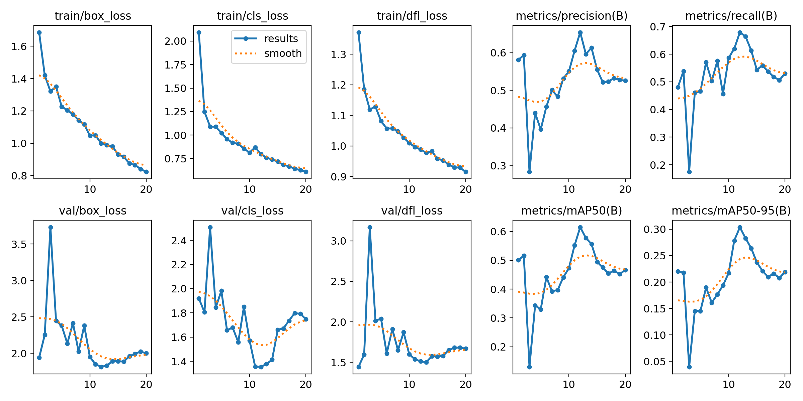

# Proyecto 3 Introducción a la Visión por Computadora

## Juan Esteban Gonzalez y Leonardo Luengas

# Objetivo del proyecto

Este proyecto tiene como objetivo desarrollar un sistema de visión por computadora capaz de detectar, identificar y clasificar productos en estantes de supermercado utilizando modelos avanzados de detección de objetos, específicamente YOLOv8 (You Only Look Once versión 8). A través del uso de técnicas de aprendizaje profundo y redes neuronales convolucionales, el sistema busca ayudar a personas con visión a reducida a ubicar objetos en las estanterías de los supermercados. Recibe como entrada un video de las estanterías en un supermercado y en tiempo real, identifica los objetos en la estantería y da una descripción corta de como se relacionan espacialmente entre sí.

# Preentrenamiento y Preparación de los Datos
El proceso de preentrenamiento comenzó con la obtención de datos a partir de un video grabado por nosotros mismos, el cual capturaba distintas perspectivas de productos organizados en estantes de supermercado. A partir de este video se extrajeron 611 fotogramas. Posteriormente, se utilizó la herramienta CVAT (Computer Vision Annotation Tool) para realizar la etiquetación manual de los productos presentes en cada imagen.  Cada objeto fue clasificado y delimitado mediante cajas delimitadoras (bounding boxes), estableciendo así la base del conjunto de datos anotado.

Una vez estructurado el conjunto de datos, se preparó el archivo de configuración data.yaml indicando la ruta de las imágenes, etiquetas y clases a detectar. Para el entrenamiento del modelo YOLOv8, se utilizaron los siguientes parámetros: 20 épocas, tamaño de imagen de 640x640 píxeles, y una configuración de red basada en el modelo YOLOv8n (versión ligera). Todo el proceso se llevó a cabo en un entorno Google Colab.

El objetivo de este reentrenamiento es afinar el modelo para reconocer objetos en un supermercado y segmentarlos adecuademente. Se utilizó la label genérica de producto dado que el refinamiento de que tipo de producto es se hará en pasos posteriores.

Estos fueron los resultados del entrenamiento:
### **Imagen de varios frames en entrenamiento**

### **Métricas del entrenamineto**

### **Matríz de confución**

### **Prueba con una imágen nueva**

### Análisis de Resultados
Tras completar el proceso de entrenamiento del modelo YOLOv8 durante 20 épocas, se evaluó su desempeño sobre el conjunto de validación utilizando métricas estándar de detección de objetos. Entre las más relevantes se encuentran la precisión (Precision), el recall (Recall) y la media de precisión promedio (mAP, mean Average Precision) a distintos umbrales de IoU.

Durante las primeras épocas, el modelo mostró una rápida disminución en la función de pérdida (loss), lo cual es indicativo de una buena adaptación inicial a los datos. A medida que avanzaron las épocas, las curvas de entrenamiento se estabilizaron, reflejando una convergencia progresiva del modelo.

Los valores de mAP@0.5 y mAP@0.5:0.95 alcanzaron niveles aceptables, indicando que el modelo fue capaz de detectar y clasificar correctamente los productos en la mayoría de las imágenes de validación. Las predicciones visuales también confirmaron esta tendencia, mostrando detecciones precisas en distintas posiciones del estante y bajo diversas condiciones de iluminación.

Sin embargo, se observaron algunos errores de clasificación en productos visualmente similares y pequeñas omisiones en objetos parcialmente ocultos, lo cual sugiere posibles mejoras mediante el aumento del conjunto de datos, refinamiento de las etiquetas o uso de un modelo más complejo (por ejemplo, YOLOv8m o v8l).

En resumen, el modelo demostró una capacidad sólida para identificar productos en estantes con un nivel de precisión adecuado para una aplicación práctica, y se establecen las bases para futuras mejoras e implementación en tiempo real.

# Pipeline de Inferencia

El pipeline de inferencia de nuestro modelo se compone de 4 pasos.

## Frame Analyzer (con YOLO)

Este componente se encarga de analizar cada frame del vídeo del supermercado y corre nuestro modelo de YOLO reentrenado para detectar objetos en las estanterías del supermercado. Posteriormente guarda la información de los bounding boxes de cada objeto en el frame y el label genérico para ser refinado posteriormente.

## Subimage Extract

Este componente se encarga de tomar la imágen encontrada y recorta el pedazo que se encuentra dentro del bounding box para facilitarle el análisis al modelo OCR en el siguiente paso.

## OCR

Este componente toma las subimágenes del componente anterior y construye un label con el texto que encuentra en el producto usando el modelo de Optical Character Recognition OCR. El modelo construye el label general a través de una concatenación de los snippets de texto que encuentra sobre el producto. Primero los ordena en orden de confiabilidad y después filtra los que reconozcan algún caractér especial que no se encuentra típicamente en un producto de supermercado.

## CLIP Description

Este componente utiliza el label encontrado por OCR como descriptor de cada objeto. Con esta información, utilizamos unos templates de relaciones espaciales básicas entre objetos. Le damos a CLIP la región de la imágen que engloba a los dos objetos y las frases con las relaciones básicas espaciales de los mismos. Aprovechamos que CLIP representa la información multimodal en el mismo espacio vectorial y encontramos la frase que está más cerca a la representación vectorial de la imágen. Esto nos asegura una alta probabilidad de que la descripción textual sea correcta respecto a la imágen real.

# Resultado Final y Conclusiones
Estos son algunos frames con las descripciones y los labels que da nuestro modelo. En la parte izquierda de arriba se ve la descripción corta de la escena con las labels que encuentra.

No fue posible lograr exportar el video completo dado que el procesamiento se demoraba más de lo que alcanzaba entrega.

La identificación del texto de cada producto fue bastante deficiente. Teorizamos que es una mezcla de una falta de resolución de la cámara y también una lejanía de la misma del objeto que quiere analizar. En el video se puede ver que hay varias labels de palabras que no tienen sentido en algunos frames. Esto hace que el trabajo con CLIP sea más propenso a errores y no represente la información que buscamos.

Por otro lado, el modelo hace las comparaciones dos a dos de los objetos en cada frame a pesar de que algunos estén demasiado lejos para que la descripción de CLIP sea relevante. Una mejora a futuro puede ser implementar una verificación que haga el modelo para evitar hacer comparaciones como estas que no aporten información al usuario.
