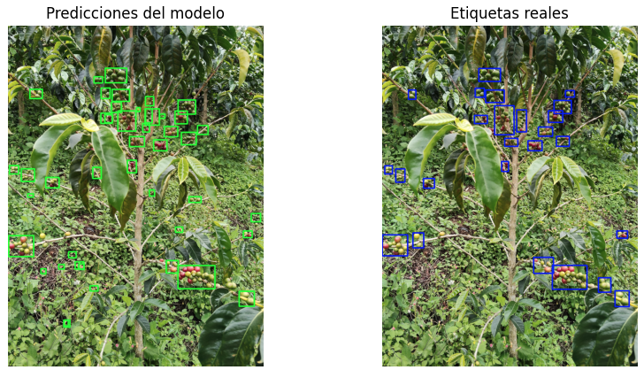
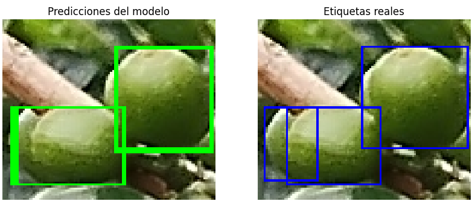
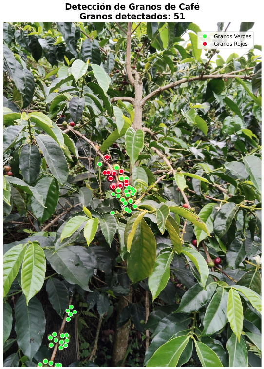
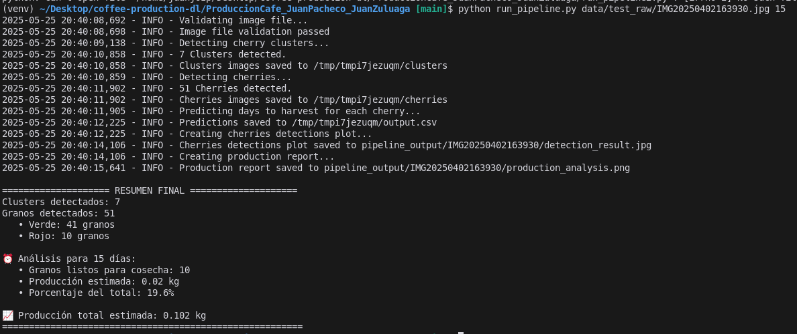

# ☕ Modelo Predictivo para la Producción Cafetera

## 📌 1. Resumen del problema y su impacto social

La predicción precisa de cosechas es una necesidad crítica en la industria cafetera. Los métodos tradicionales, como el muestreo manual, son costosos, lentos y propensos al error humano. Esto afecta la logística, la planificación de la mano de obra y la negociación de contratos de exportación, especialmente en ventas a futuro.

Este proyecto propone una herramienta automática basada en visión por computadora y aprendizaje profundo para estimar la producción de café a partir de imágenes de cafetos, facilitando la toma de decisiones estratégicas en el sector agrícola.

---

## 🧠 2. Arquitectura y justificación de decisiones

La solución se compone de una cadena modular de modelos que colaboran para estimar la producción en kilos para un intervalo de fechas específico:

### 🔹 1. YOLOv8 – Detección de Clústeres

Detecta agrupaciones de cerezas en las ramas del cafeto. Entrenado con imágenes propias y etiquetado manual, proporciona zonas de interés para análisis detallado.

### 🔹 2. YOLOv8 – Detección de Granos (Verdes y Rojos)

Detecta cerezas individuales dentro de los clústeres recortados. El enfoque de dos etapas mejora la precisión al eliminar el ruido visual del entorno.

### 🔹 3. CNN – Estimación de Días a Cosecha

Modelo de regresión que estima cuántos días faltan para la maduración de cada cereza, a partir de su imagen y su clase (roja o verde).

### 🔹 4. Cálculo de Producción

Filtra las cerezas listas para cosecha dentro de un intervalo temporal definido por el usuario, calcula su número y multiplica por el peso promedio por grano para obtener el total en kilogramos.

> 🧩 **Resumen del pipeline:**  
> `YOLOv8 Clusters → YOLOv8 Granos → CNN Regressor → Reporte de Producción`

---

## 🗂️ 3. Dataset utilizado

-   📸 **Origen:** Fotografías tomadas directamente en un cafetal real.
-   🔢 **Cantidad:** Se capturaron ~100 fotos; se seleccionaron 20 imágenes representativas para el proyecto.
-   🏷️ **Etiquetado:**
    -   _Clústeres:_ Usando LabelMe para marcar agrupaciones.
    -   _Granos:_ Etiquetados por clase (rojo, verde) también usando LabelMe.
    -   _Regresión:_ Con etiquetas manuales de días hasta cosecha, basadas en experiencia agrícola e investigación en la web.

> ✅ Dataset propio y controlado, adaptado al contexto caficultor.

---

## 📊 4. Métricas y resultados

### 🍇 YOLOv8 – Detección de Clústeres

| Métrica   | Valor |
| --------- | ----- |
| F1 Score  | 0.60  |
| mAP@0.5   | 63.8% |
| Precisión | 69.1% |
| Recall    | 53.3% |



> Rendimiento aceptable como etapa inicial de segmentación gruesa.

---

### 🍒 YOLOv8 – Detección de Granos

#### Clase Verde

| Métrica   | Valor |
| --------- | ----- |
| F1 Score  | 0.95  |
| mAP@0.5   | 97.8% |
| Precisión | 93.9% |
| Recall    | 97.0% |

#### Clase Roja

| Métrica   | Valor |
| --------- | ----- |
| F1 Score  | 0.95  |
| mAP@0.5   | 97.8% |
| Precisión | 99.4% |
| Recall    | 91.7% |



> 🎯 Precisión sobresaliente (>95%), incluso en condiciones reales de iluminación y complejidad visual.

---

### 📈 CNN – Regresión de Días a Cosecha

| Métrica | Valor     |
| ------- | --------- |
| MAE     | 6.21 días |
| RMSE    | 8.96 días |
| R²      | 0.9434    |
| MSE     | 80.27     |

> 📅 El modelo logra una excelente correlación con datos reales de maduración, siendo útil para estimaciones precisas de cosecha.

---

## 🌀 5. Pipeline y Reporte de Producción

Una vez entrenados los modelos, se integraron en un script ejecutable `run_pipeline.py` que procesa una imagen de cafeto completa y genera un reporte visual y estadístico del estado actual de la producción. El flujo final es:

1. **Validación de la imagen de entrada.**
2. **Detección de clústeres** de cerezas (gajos).
3. **Recorte y detección de granos individuales** dentro de esos clústeres.
4. **Predicción del tiempo de maduración** para cada grano detectado (modelo CNN).
5. **Generación de visualización de detección** de granos clasificados por color.
6. **Creación de un reporte de producción**, que incluye:
    - Distribución por clase.
    - Histograma de maduración.
    - Proyección de cosecha acumulada.
    - Producción estimada en kg.

### 🎯 Resultado visual: detección final sobre la imagen original



---

### 📊 Reporte gráfico de producción generado automáticamente


---

### 💻 Salida en consola del pipeline completo



---

Este pipeline permite a cualquier caficultor, ingeniero agrónomo o entidad de apoyo técnico analizar rápidamente el estado de un cultivo de café a partir de una simple imagen, brindando información clave para la planificación de la cosecha, la logística de recolección y la proyección de ventas futuras.

## 7. Instalación y ejecución

Debe clonar el repositorio e instalar las dependencias, preferiblemente en un entorno virtual para evitar conflictos (probado en python 3.10.15):

```bash
git clone https://github.com/JuanJoZP/coffee-production-dl
cd coffee-production-dl/ProduccionCafe_JuanPacheco_JuanZuluaga
python -m venv venv
source venv/bin/activate # en linux
venv\Scripts\activate.ps1 # en windows
pip install -r requirements.txt
```

Luego puede ejecutar `python run_pipeline.py --help` para ver como se usa el script. Aseguese de ejecutar el script desde la carpeta `ProduccionCafe_JuanPacheco_JuanZuluaga`.

Ejemplo de uso:

```bash
python run_pipeline.py data/test_raw/IMG20250402163325.jpg 15
```

## 🚀 6. Lecciones aprendidas y trabajo futuro

### ✔️ Lecciones clave

-   Un pipeline por etapas especializadas mejora la precisión general del sistema.
-   La calidad del etiquetado es clave para el rendimiento de los modelos.
-   El enfoque de detección + regresión permite transformar imágenes en cifras útiles para la industria.

### 🔮 Trabajo futuro

-   📈 Aumentar el tamaño y variedad del dataset (condiciones climáticas, iluminación, cafetales diferentes).
-   📹 Incluir seguimiento temporal con series de imágenes o video.
-   📱 Desarrollar una interfaz web o app móvil para despliegue en campo por caficultores.

---

> 🧠 Este proyecto demuestra el potencial del aprendizaje profundo para transformar procesos agrícolas tradicionales, aportando eficiencia, precisión y escalabilidad al corazón de la economía cafetera.
